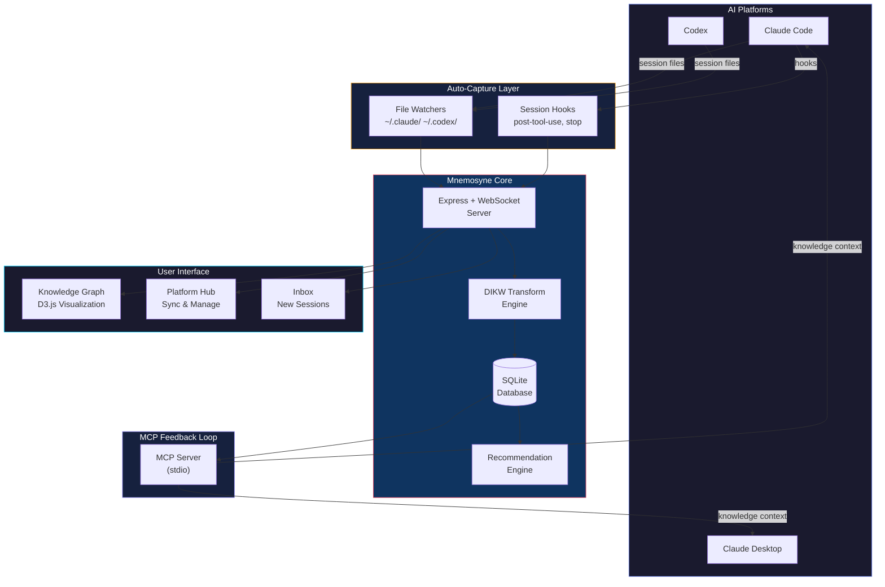

<div align="center">

# 🏛️ Mnemosyne

### Persistent Memory for AI Agents

[](https://empirehacks.org)
[](#)
[](LICENSE)
[](#)
[](#)
[](#)

**Your AI tools generate valuable knowledge every session — then forget everything.**
**Mnemosyne remembers.**

[Getting Started](#-quick-start) · [Architecture](#-architecture) · [How It Works](#-how-it-works) · [API Reference](#-api-reference) · [Contributing](CONTRIBUTING.md)

</div>

---

## 🎯 The Problem

Every time you close an AI session, all context is lost:

- **Claude Code** doesn't remember what you researched yesterday
- **Codex** can't access insights from your Claude sessions
- Valuable decisions, patterns, and lessons are buried in chat logs nobody revisits
- You repeat yourself across sessions, re-explaining context every time

> **The more you use AI tools, the more knowledge you lose.**

## 💡 The Solution

Mnemosyne is an **agent-agnostic knowledge management layer** that sits between your AI tools and creates persistent, cross-platform memory.

It automatically:
1. **Captures** raw conversation data from Claude Code and Codex via file watchers & hooks
2. **Transforms** it through a DIKW pipeline (Data → Information → Knowledge → Wisdom)
3. **Visualizes** everything as an interactive knowledge graph
4. **Feeds it back** into your AI tools via MCP (Model Context Protocol)

> **The more you use AI tools, the smarter they become.**

---

## ✨ Key Features

### 🔄 Auto-Capture Engine
File watchers monitor `~/.claude/projects/` and `~/.codex/sessions/` in real-time. When a session completes, Mnemosyne automatically ingests the conversation — no manual export needed.

### 🧠 DIKW Transform Pipeline
Raw AI conversations are transformed through four levels using LLM-powered reflection:

```
┌─────────┐     ┌─────────────┐     ┌───────────┐     ┌────────┐
│  Data   │ ──▶ │ Information │ ──▶ │ Knowledge │ ──▶ │ Wisdom │
│ (raw)   │     │ (context)   │     │ (patterns)│     │ (meta) │
└─────────┘     └─────────────┘     └───────────┘     └────────┘
  Tool calls,      What happened,      Reusable          When & why
  file excerpts    why it matters       techniques        to apply them
```

### 🌐 Cross-Platform Knowledge Graph
Interactive D3.js force-directed graph with color-coded DIKW nodes. Pan, zoom, click to explore connections across all your AI sessions.

### 🔌 MCP Feedback Loop
Mnemosyne exposes an MCP server that feeds accumulated knowledge back into Claude Desktop, Claude Code, and any MCP-compatible client. Your AI assistant gains persistent memory.

### 🛠️ Platform Hub
Sync skills, MCP servers, and configurations between Claude Code and Codex with one click. Right-click context menus for quick actions.

---

## 🏗️ Architecture



---

## 🔬 How It Works

### 1. Session Capture

Mnemosyne monitors AI tool directories using `chokidar` file watchers:

```javascript
// Watches for new/modified session files
watch('~/.claude/projects/**/*.jsonl')  // Claude Code sessions
watch('~/.codex/sessions/**/*.jsonl')   // Codex sessions
```

When a session file changes, the watcher automatically parses tool calls, responses, and metadata into **Data nodes**.

### 2. DIKW Transformation

The engine processes Data nodes through three LLM-powered reflection stages:

| Stage | Input | Output | Example |
|-------|-------|--------|---------|
| **D → I** | Raw tool calls & responses | Contextual summary | "User researched WebAssembly edge computing trends" |
| **I → K** | Information nodes | Reusable patterns | "When evaluating new tech, compare: community size, benchmark data, production adoption" |
| **K → W** | Knowledge nodes | Strategic judgment | "Prioritize technologies with both strong benchmarks AND growing community — performance alone isn't enough" |

### 3. Knowledge Graph

All nodes and connections are visualized in a real-time D3.js force-directed graph:

- 🟣 **Data** — Raw session artifacts
- 🔵 **Information** — Contextualized insights
- 🟢 **Knowledge** — Reusable patterns & techniques
- 🟡 **Wisdom** — Meta-level judgment & strategy

### 4. MCP Feedback

The MCP server exposes three resources to any connected AI client:

```
mnemosyne://knowledge-nodes    → All Knowledge-level insights
mnemosyne://wisdom-nodes       → All Wisdom-level insights  
mnemosyne://graph-summary       → Full graph overview
```

When Claude Desktop connects, it can access your accumulated knowledge as live context.

---

## 🚀 Quick Start

### Prerequisites

- **Node.js** 18+ and npm
- **Git**
- (Optional) Claude Code and/or Codex installed for auto-capture

### Installation

```bash
# Clone the repository
git clone https://github.com/ChangXiang-SCU/empirehacks-2026.git
cd empirehacks-2026

# Install dependencies
npm install
cd backend && npm install && cd ..
cd frontend && npm install && cd ..
```

### Run

```bash
# Start the backend (port 3001)
npm run backend

# In another terminal, start the frontend (port 5173)
npm run frontend
```

Open **http://localhost:5173** — you'll see the Mnemosyne knowledge graph.

### Production Build

```bash
npm run build:frontend
npm start
# Frontend is served from backend at http://localhost:3001
```

### Connect to Claude Desktop (MCP)

Add to your Claude Desktop config (`claude_desktop_config.json`):

```json
{
  "mcpServers": {
    "mnemosyne": {
      "command": "node",
      "args": ["<path-to-repo>/backend/mcp-stdio-server.mjs"]
    }
  }
}
```

Restart Claude Desktop — you'll see "Add from mnemosyne" in the + menu.

---

## 📁 Project Structure

```
mnemosyne/
├── backend/
│   ├── server.js              # Express + WebSocket + DIKW engine + API
│   ├── mcp-stdio-server.mjs   # MCP server for Claude Desktop integration
│   ├── lib/                   # Modular utilities
│   └── db/                    # SQLite database (auto-created)
├── frontend/
│   ├── src/
│   │   ├── components/
│   │   │   ├── MindPalace.jsx     # D3 force-directed knowledge graph
│   │   │   ├── ConnectPanel.jsx   # Platform Hub (skills, MCPs sync)
│   │   │   ├── NodeCard.jsx       # DIKW node detail view
│   │   │   ├── Sidebar.jsx        # Project filter panel
│   │   │   └── InboxPanel.jsx     # Unclassified session inbox
│   │   └── App.jsx
│   ├── dist/                  # Production build output
│   └── vite.config.js
├── hooks/                     # Claude Code hook scripts
│   ├── post-tool-use.sh       # Captures each tool call
│   ├── stop.sh                # Triggers DIKW reflection on session end
│   └── session-start.sh       # Loads context from knowledge graph
├── demo/                      # Demo seed data
├── launcher.mjs               # Auto-launcher script
├── package.json
├── LICENSE
└── CONTRIBUTING.md
```

---

## 📡 API Reference

### REST Endpoints

| Method | Endpoint | Description |
|--------|----------|-------------|
| `GET` | `/api/graph` | Fetch full DIKW graph (nodes + connections) |
| `GET` | `/api/nodes?type=K` | Filter nodes by DIKW type |
| `POST` | `/api/import` | Upload ChatGPT/Claude export (multipart) |
| `POST` | `/api/dikw/transform` | Trigger DIKW pipeline on Data nodes |
| `POST` | `/api/hook/tool-use` | Claude Code hook endpoint |
| `GET` | `/api/platform/skills` | List skills from Claude Code & Codex |
| `GET` | `/api/platform/mcps` | List MCP servers from both platforms |
| `POST` | `/api/platform/mcps/sync` | Sync MCP server between platforms |

### WebSocket Events

| Event | Direction | Description |
|-------|-----------|-------------|
| `node:added` | Server → Client | New DIKW node created |
| `connection:added` | Server → Client | New edge in graph |
| `dikw:transform:complete` | Server → Client | Pipeline finished |
| `filewatcher:new-session` | Server → Client | New session detected |

### MCP Resources

| URI | Description |
|-----|-------------|
| `mnemosyne://knowledge-nodes` | All Knowledge-level nodes |
| `mnemosyne://wisdom-nodes` | All Wisdom-level nodes |
| `mnemosyne://graph-summary` | Aggregated graph overview |

---

## 🛤️ Roadmap

- [x] Auto-capture from Claude Code & Codex
- [x] DIKW transform pipeline with LLM reflection
- [x] Interactive knowledge graph (D3.js)
- [x] MCP server for Claude Desktop integration
- [x] Platform Hub with cross-platform sync
- [x] Claude Code hooks (post-tool-use, stop, session-start)
- [ ] ChatGPT export import support
- [ ] Multi-user collaboration
- [ ] Custom DIKW transformation rules
- [ ] Knowledge graph search & semantic query
- [ ] Mobile-friendly responsive UI
- [ ] Plugin system for custom data sources

---

## 🤝 Contributing

Contributions are welcome! See [CONTRIBUTING.md](CONTRIBUTING.md) for guidelines.

---

## 📄 License

[MIT](LICENSE) — free for personal and commercial use.

---

<div align="center">

**Built with 🧠 for [EmpireHacks 2026](https://empirehacks.org) — Track 3: The Sidekick**

*"The more you use AI tools, the smarter they become."*

</div>
